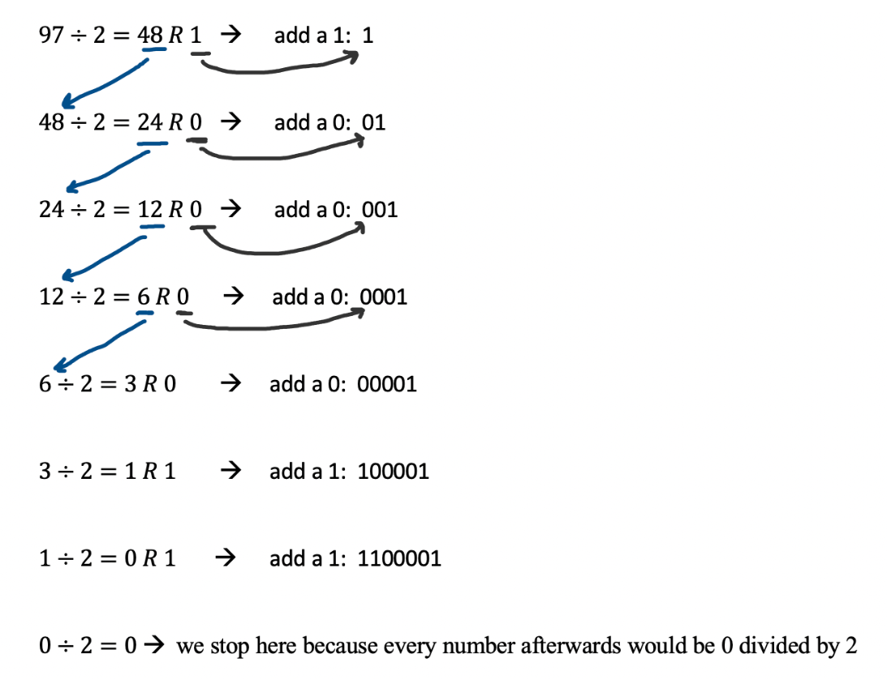

## W3lc0m3 t0 Crypt0 W33k, Day 2!!

### First Up, Mini Math Review!

We know, we know. We promised to teach you about cryptography, not math, 
but we *promise* that math is an integral part in cryptography.  

In cryptography, cybersecurity, and generally in coding, it is important to understand exponents.

#### What Are Exponents?

- They tell how many times a number should be multiplied by itself
- For example... 
  - 21 = 2
  - 22 = 2 x 2 = 4
  - 23 = 2 x 2 x 2 = 8
  - 33 = 3 x 3 x 3 = 27
  - 52 = 5 x 5 = 25
  - **20 = 1,  30 = 1,  40 = 1,  50 = 1**
  - **Any number raised to the 0th power is one.**
  - If you want to know why, check out what the multiplicative identity is

#### Pro Tip About Counting

In programming, counting often starts at 0 instead of 1.  
If you're counting left to right, the “**c**” in **computers** is in the 0th position. The “**o**” is in the 1st position, the “**m**” is in the 2nd position, and so on.

## Binary to Base 10, the Basics

What is the Binary Number System?
- The binary number system is made up of only 0s and 1s.
- The prefix in binary is “bi” which means **two**. Binary code is only made up of **two** numbers.
- Another name for the binary system is base 2

What is the Base 10 Number System?
- The base 10 number system is what we use everyday!
- It is also known as the decimal system
- Base **10** uses **10** digits: 0,1,2,3,4,5,6,7,8,9

### How Do You Go From Binary to Base 10?

Let’s say that you have this binary number: 1100001  
How do we get it to base 10?  
First, you have to understand that each binary number is multiplied by 2 to the power of the position of the binary number (2Position of binary number)

For example...

Then, in order to convert base 10, it would look like this:

So the binary number **1100001** is the number **97** in base 10!

### How Do You Go From Base 10 to Binary?

Now, how do we do the opposite and convert from base 10 to binary?

We have to divide our base 10 number repeatedly by two. 
The remainder tells us whether the binary number should be a 1 or a 0. 

Let’s start with our number we got before: 97.

First, divide 97 by 2.  
When we do that, we get 48 with a remainder of 1. 
The remainder (1) will become a part of our binary number while the quotient (48) will be divided by 2. 
This process repeats itself until the quotient becomes 0.

So the base 10 number **97** is the binary number **1100001**!

Here is a [reference](https://www.cs.odu.edu/~jbollen/cgi-bin/bin2dec.cgi?bin=1100001) for Binary and Base 10 if you need more practice or if you're just curious to learn more.

### Practice Converting Between Binary and Base 10!

Have a friend pick a random number between 1 and 100. 
Have your friend convert their number into binary. 
Next, your friend will give you their binary number and you have to convert it back into base 10. 
Tell your friend your base 10 number and see if the random number your friend matches your answer! 
Afterwards, try swapping roles.

## How Do You Go From Hexadecimal to Base 10?

How would we represent 0 - 15 as a single number? 
You can’t. 
So you have to create a character representing a number. 
Now A = 10, B = 11 etc

0 = 0  
1 = 1  
2 = 2  
3 = 3  
4 = 4  
5 = 5  
6 = 6  
7 = 7  
8 = 8  
9 = 9  
A = 10  
B = 11  
C = 12  
D =13  
E = 14  
F = 15  

Just like in base 10 where we have a number like 3912, we could view it as 3000 + 900 + 10 + 2.

Or as:

3 x 103,  9 x 102, 1 x 101, 2 * 100

Now what would 192 written as hexadecimal be?

1 x 162 + 9 x 161 + 2 x 160 

1 x 256 + 9 x 16 + 2 x 1 = 256 + 144 + 2 = 402

What is 2FC then in hexadecimal?

2 x 162 + 15 x 161 + 121

2 * 256 + 15 x 16 + 12 = 512 + 240 + 12 = 764

Safe number system. 

## How Do You Go From Base 10 to Hexadecimal?

What About base 10 to hexadecimal?

Starting from the decimal number 764.

How many times does 256 divide into 764 as a whole number? 

2 times. Therefore in the 16^2 spot we would put 2.

764 - 2 * 256 = 252 or 764 - 512 = 252

How many times does 16 divide into 252 as a whole number?

15 times. Therefore in the 16^1 spot we would put F

252 - 15 * 16 = 12 or 252 - 240 = 12

The remaining number 12 is then converted directly from base 10 to base 16. This would be C.

That's how we got 2FC in the original problem. 

Now, binary and hexadecimal are very similar. That’s why in computer science the two are used frequently.

## How Do You Go From Binary 10 to Hexadecimal?

0000 - 0  
0001 - 1  
0010 - 2  
0011 - 3  
0100 - 4  
0101 - 5  
0110 - 6  
0111 - 7  
1000 - 8  
1001 - 9  
1010 - A  
1011 - B  
1100 - C  
1101 - D  
1110 - E  
1111 - F

Each hexadecimal digit 0 - F can be represented as 4 1s and 0s.
